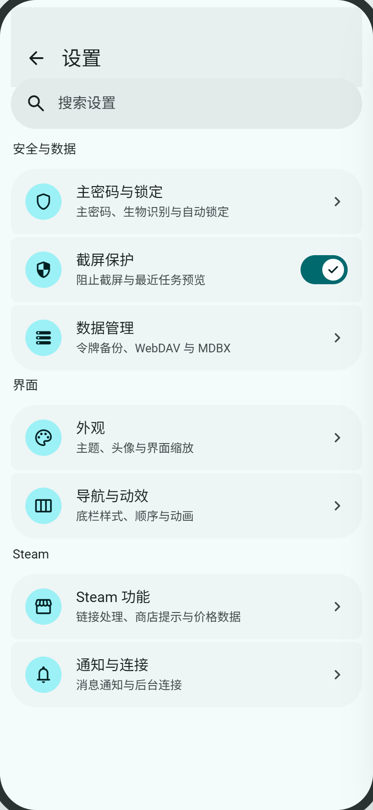
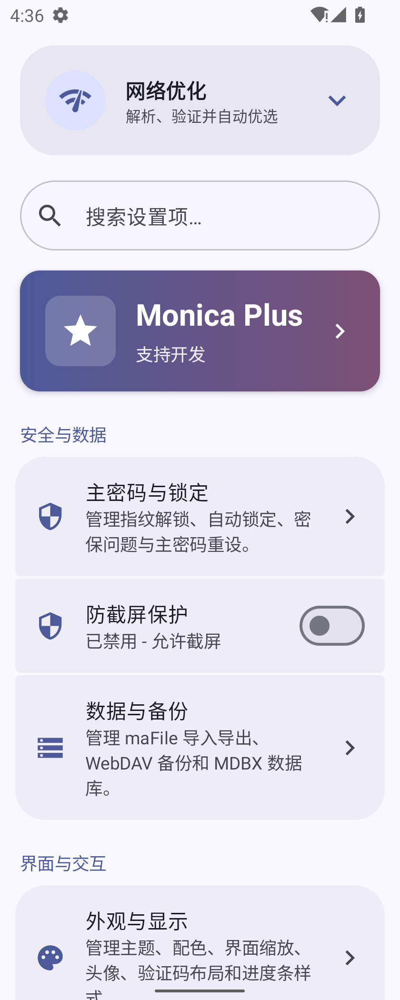
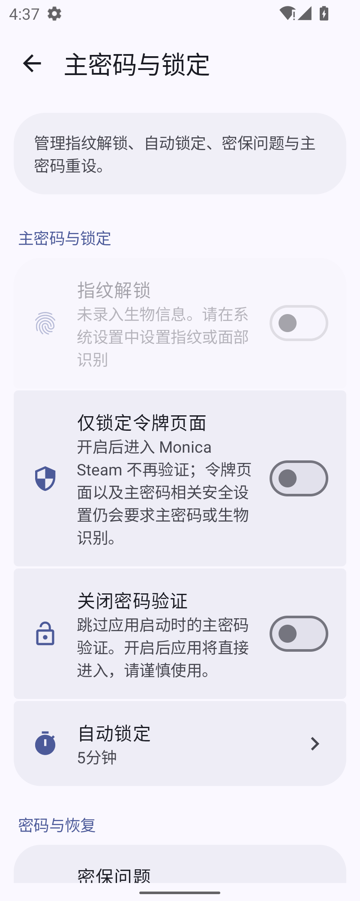
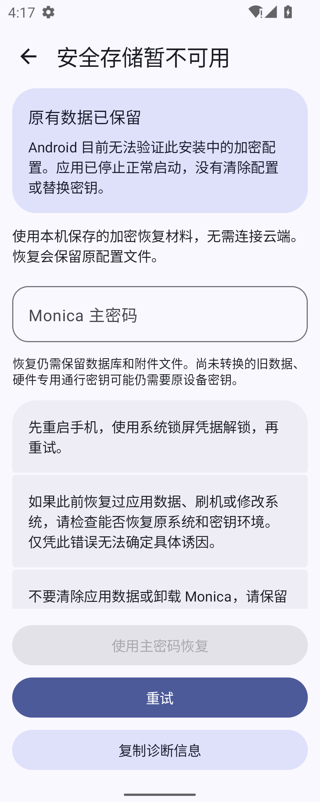
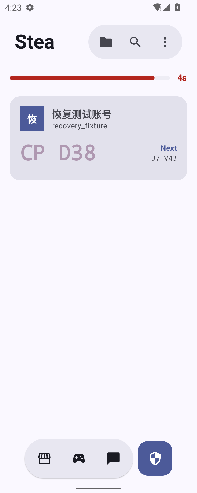
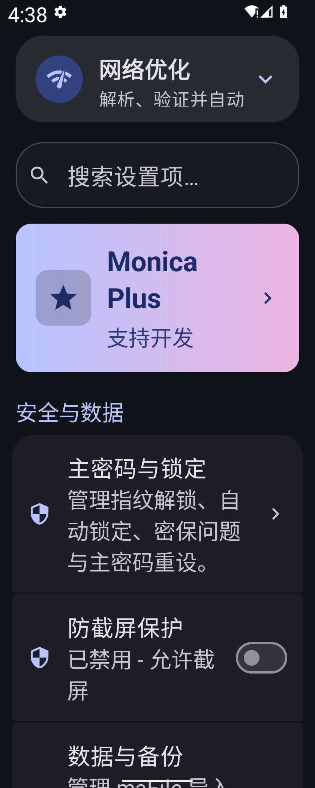
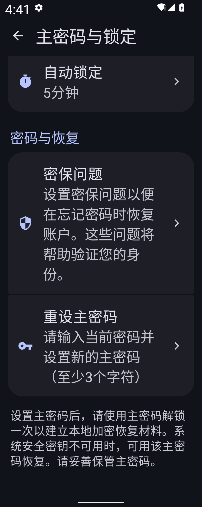

# Steam 设置与安全恢复

2026-10-05，与 Monica Android 的设置分组样式和本地主密码恢复流程同步。

## 可编辑设计

草图源文件为 [canvas.json](canvas.json)，[在本地 M3E Canvas 打开草图](http://127.0.0.1:5186/#docz=xVlvT9tIGv8qyK9BIiFQlnddrU46rfrqpLuTTlXlJBNiYWKv4wC9CgkohYCAsIVAS8PyZ8PCsm3CbnuFjUOR7qs0M7Zf9SvcMx7j2I4x5griFZ7heWae3_NvfjN5xqmCKiJuiHsk5YQU3_U3FfGjXf897TJqn_TzWutspXWm4fqcvjtNpvdxdZnr5pKKgDKgQv640NePumzNh7m0IglpWxEX53Rt9ktzKxZPy116-bX--vxLcymegBGubuDKnHH4EiboWH9zZs5ozhRVMDc_GKfbX5pvWhfboGyb1Tpbw7__hF8c4NLPn6dmwJSMwo9S6-WslEMwlkVezUjKKEzxzB46yYtIVdH36ClMw0IizKlZRBWfcWleGeGGMryYR4BMUrOPpDTKc0OqUoCJfJaX6fqKVMilEV0sI-VUawJkJRiPSqog5WAGTcgKyueFMcRN2obBMv96xoENQ1xWGqX25Zi5zEcwnuCGers5sKt3stuWFKXUiJAbbgs7AYBgmOvTuLbFFBMJv6qCUtIYUp62dfX3mq7tgLr58qB1toxLdYgYUx8cvFR_3M0NA0DZZW5vjyrJTC4Wt8QGuzl-QgARji4_zMvcEPxDUNGoSw2UemykgMGeeSjL3_IKTIl8Eolu9PmCLEuKStEOcTAWUpYneUWRxp8k-dSIPRfnhnIFUezmxnhF4C3_ZwRRtOKRF_4NQPsGB9kniA4kJh87LuntySNeSWW9WAaigHEUbShs7IVCViv6h_3rADkr3RxM_4AHDK4t4BdHkAikfEKWaz3MDje2WH8kcFctdBk2NKG6YPqkr0TKgEVDGUs4IOOJMJBeeNFiR4uojUYU8upfQcCFKLCoPKAcic9T0_r6jr7wq1Gfw8XfQMGYP8aLR47aZZSzAhLT7ShzqSwaU6TcE0UYzlJvhgc8JSk5pORpT1JF6hNoUgr7m4Qx_QPDxKTjtQdxx2f5lIJQLp-V1FDQpHiMfy9BSyWLVT9c85VG3u3bEuD6ypRx8WNL0_Dinrk_axwW3emcKiiC-vT_h5pFqRGYvGyy44IK5WGPfH6w3RDFC2le5cPxW_mk1_b01bmOcGtVfWEJV-db2jlE_B8o-d3Dv8OJs9L16Ltv_-kCr0oKP4xuK8xeeHEbX9wL0F0cennJ3N4PKPxELFJl-PSD650J3XGZO5u4MCQiYeBlGToqn0uh0HADzzAOZwLq2tx_BSHG1Q_4Oc11Zoje_JWsf2oH2mYN91LPOX4sHFm9aRSPwXRoQ6Rc9EPEjTLZLZHdU9wsAVBzr4EbJSatr2ttiGMCGn8yjtDIvWWzxesCknmgNx4lEbzqwblsydxxKl_u4QLQFwlABvFqAWhjaLQZ-cWLO8bz8462vfaJrBzg6iy0NJrT5Tnc2CSlVb3aoNxdOyW7TecYdbUwlFEokb2X5AbGnIEbA-XN4cDNqS1954AeuBc_AUo_dvKxSKbrjhBeXcGlE0fUBuvf7T7yPNZm04n-G9JpL5MJotPXU5m7odaxHuPwZ9jQ2dZdx5c4v4lUBlctFFzRPuk7re0OkF54sXgkfElBCk10N79k-3WcWuf0rk2W5vXGn6S4AeeV-fzIEbWjmwFZpMiK8BWVHUrGblTnqjSCcuEkXHvBnMrIl7n3Hz9so3ZhbtZIuURmd1gDJJsfzeMloz7tpP2tMfDb4qHJpzKfD-9sxul742Ier9bpPcKC0xFw6-FDXzkhlQX7-YOJG3tLrbNGGzRtEE8k2XL1_eLmC2p4mvvuTR68_V24OGe-3GkDU4VRpNxbx3ZaKnv2CuptiXikLn7VSldctb3Sd9zcOndz4-uPhO-HAspff5bDTpDSUMxAvv2goLO1Gu2HRnN-WT-vOWVxa7fOr-hlQNFQ-N26dVEj63-6m1JA_8bna3hhuQ3Uggi8hSm3sY6gW4N548S_fETsAeaEvAkxEO-NkhD-FaK8wlhvEqTyFldOWCqS7VWy8bojU9h7pvVA5HvVhIPhS3MJvm1Xn_7BnuX0rVnfE_bnqRmjfop_OcAbs7TN1vZcbz0zt3ecMPfG4u4nPMc3DiN03mEd105wV7sU1JIW-wshhLYDLWfarnr3Cs8cBVvcyQyDzAVKoUi2wd_Y3Kc3EclkS7XHbnMhDWJlB446dleB4LHz7woaVHlLKg28uAtBc2cLxJ9s7pr06YpeAlqNH_Xf6sEhDQtdEH553As-3hcNPGUC45KS9vb7v9hWXGK3f0IJoDQ2_b-pubTy8l6L-3yn1VUWw468GBop5nJoW9CoycZJMGFlQlCdreYWLu6ar6sQYPMF7ezAX6HbARNgYHFjjWzv6W9qLFLhRdU-_DpBi8KoEJ5jwJmBZZDNQ9Y7oFkAo2xpyzRlfpkGA6Fl4Oq8Hws-2SKVY-P8LVneh3YC-ixN6cvw3tuW9rF1tgZpCTdRIGd2W9KW2eqQkOR92ahruLRxQ4ABcbU_vJHtfxCtd9gfPcmCqkouZu6MnbZsVVnnD39fZ7lq_TDlsnugbyCi3aB6vdWQjUa9zE4IJyfbJoOwldeRLU4L_HBOAmqT8pr9wPU2FWZ2W_9622k9FT8a9UWy8e5GVj-e_B8) 使用 `http://127.0.0.1:5186/#docz=`。在父工作区运行 `.tools/start-m3e-canvas.ps1` 后打开该地址，或在本地 Canvas 导入 JSON；设计记录不依赖浏览器缓存。

草图涵盖设置首页、主密码与锁定、系统密钥不可用恢复页，使用 searchBar、listItem、textField、button 等现成组件。原生页面保留 Steam 网络优化和 Monica Plus 入口；草图聚焦其下的设置分组。草图采用青色示例主题，原生截图保留测试安装的紫色主题。

- 页面分组左右留白 12dp，外侧圆角 24dp，相邻项圆角 4dp，行间距 2dp。
- 开关支持整行点击；文字与右侧控件之间留出 12dp。
- 主密码页面区分锁定选项和密码恢复，保留 Steam 的“仅锁定令牌页面”选项。
- 恢复页保留原有文件，提供主密码输入、错误反馈、重试和诊断复制；内容滚动，主要操作保持可达。

## 渲染记录

Canvas 预览：

原生设置首页：

原生主密码与锁定：

系统密钥删除后实际启动页与恢复后的合成账号：

深色模式与系统字体 1.5 倍下，设置项和页面底部恢复说明均可滚动访问：

安全行为、升级前提和测试结果见 [验证记录](../../security/local-vault-recovery.md)。
